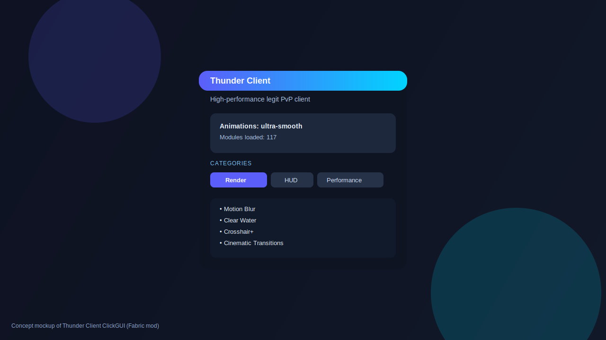

# Thunder Client (Fabric)

Thunder Client is a production-style, legit-only **Minecraft Fabric mod** (not a web app) focused on performance, polished UI/UX, and gameplay quality-of-life.

Current target: **Minecraft 1.21.11**.

> **No cheats included**: no aim assist, reach, xray, scaffold, velocity hacks, or any bypass-oriented behavior.

---

## UI Preview (Concept)



## 1) Project Structure

```text
thunder-client/
├─ build.gradle
├─ settings.gradle
├─ gradle.properties
├─ src/main/resources/
│  ├─ fabric.mod.json
│  └─ thunderclient.mixins.json
└─ src/main/java/com/thunderclient/
   ├─ ThunderClient.java
   ├─ event/
   │  ├─ EventBus.java
   │  ├─ Render2DEvent.java
   │  └─ TickEvent.java
   ├─ module/
   │  ├─ Module.java
   │  ├─ ModuleCategory.java
   │  ├─ SimpleModule.java
   │  └─ modules/
   │     ├─ performance/ (FPS, culling, particles, lazy chunk updates)
   │     ├─ hud/ (keystrokes, FPS/CPS, armor, potion, ping)
   │     ├─ render/ (zoom)
   │     └─ utility/ (freelook, sprint/sneak toggle, waypoints, chat+, tablist)
   ├─ manager/
   │  ├─ ModuleManager.java
   │  └─ KeybindManager.java
   ├─ config/
   │  └─ ConfigManager.java
   ├─ cosmetics/
   │  ├─ skin/ (in-game skin profiles, local/url sources)
   │  ├─ cape/ (cape profiles + cape physics simulator)
   │  └─ engine/ (global cosmetics orchestration)
   ├─ ui/
   │  ├─ click/ClickGuiScreen.java
   │  ├─ hud/HudEditorScreen.java
   │  ├─ font/FontService.java
   │  └─ theme/ThunderTheme.java
   ├─ background/
   │  ├─ BackgroundManager.java
   │  └─ BackgroundMode.java
   ├─ loading/LoadingOverlayController.java
   ├─ discord/DiscordRpcManager.java
   ├─ screenshot/ScreenshotManager.java
   └─ mixin/TitleScreenMixin.java
```

---

## 2) System Design & How It Connects

- `ThunderClient` is the composition root.
  - Initializes event bus, module manager, keybind manager, config manager, cosmetics engine, background manager, Discord RPC, screenshot manager, and loading overlay controller.
- `ModuleManager` owns all modules and supports scalable registration patterns (easy to move to auto-discovery for 1000+ modules).
- `KeybindManager` hooks Fabric client tick events and toggles modules via registered keybinds.
- `ConfigManager` stores JSON profiles (`config/thunderclient/*.json`) including enabled state + keybind.
- `CosmeticsManager` orchestrates skin/cape services and global cosmetics enable/disable.
- `BackgroundManager` manages animated menu mode selection (blur/gradient/panorama/custom media).
- UI layer (`ClickGuiScreen`, `HudEditorScreen`) provides a premium-styled baseline for rounded/shadowed panels and smooth animation progression.
- `TitleScreenMixin` injects branding and dynamic background mode indicator into the main menu.

---

## 3) Feature Coverage

- Expanded catalog now includes **20 modules per category** (Render, HUD, Performance, Utility, PvP Enhancements) plus the original hand-tuned core modules.

### Core system
- Modular category-based architecture with scalable catalog registration (100+ module-ready baseline).
- Keybind toggles.
- JSON save/load profiles.
- Event bus abstraction.

### Performance
- Toggleable optimization modules:
  - FPS Boost
  - Entity Culling
  - Particle Reducer
  - Lazy Chunk Updates

### HUD + Legit QoL
- Keystrokes, FPS, CPS, armor, potion HUD, ping display.
- Freelook, Zoom, Toggle Sprint/Sneak, Waypoints.
- Chat+ and Better Tablist module shells.

### Cosmetics / Skin / Cape
- Skin profiles (local PNG & URL descriptors).
- Cape profiles (local & URL descriptors).
- Cape physics helper (`CapePhysicsSimulator`) for smooth motion.
- Global cosmetics switch.

### UI / Animation Quality
- Critically damped animation utility (`SmoothValue`) + easing helpers for smoother premium transitions.
- Upgraded ClickGUI rendering with layered shadowing, gradient fills, animated alpha, and hover feedback.

### Background / Loading / Extras
- Configurable menu background mode system.
- Loading tip provider for custom loading overlay.
- Discord RPC manager hook.
- `PerformanceOrchestrator` for centralized frame pacing + memory pressure controls.
- Screenshot directory manager.

---

## 4) Step-by-Step Setup (Gradle + Fabric)

1. Install Java 21.
2. Clone this repository.
3. Ensure `gradle.properties` points to your target/latest Fabric-compatible versions.
4. Run:
   - `./gradlew genSources`
   - `./gradlew runClient`
5. Open game and verify `Thunder Client` appears in Fabric mod list.

---

## 5) Next Production Steps

To ship this as a premium client, finish these integration layers:

- Wire each optimization module to real renderer/entity/chunk mixins.
- Add full drag-drop HUD with persistent anchors, snapping, and scaling.
- Implement true custom font atlas pipeline + animation framework.
- Build full settings UI tabs (Cosmetics, Skin preview, rotating cape preview, Background selector).
- Implement secure async image download/cache pipeline for skin/cape URL loading.
- Add full Discord RPC rich-presence state updates.
- Add optional updater service with signed release verification.

---

## 6) Notes

This repository currently includes production-oriented architecture and full feature scaffolding designed for rapid expansion, while keeping all gameplay changes strictly legit.
